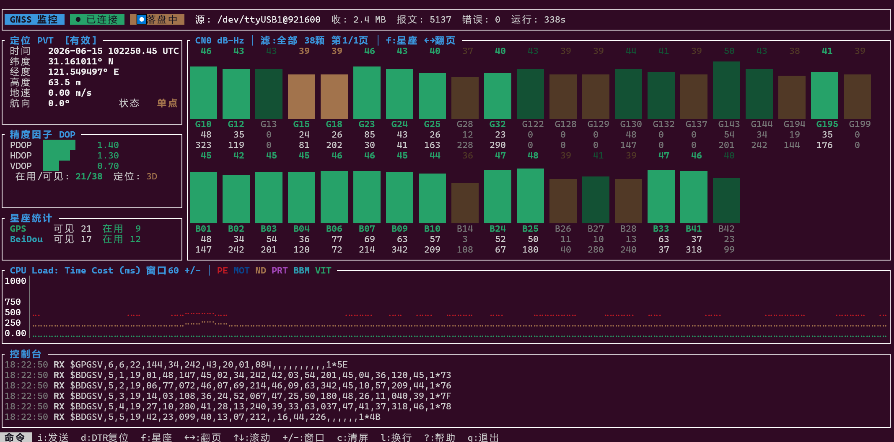

# gnss_view_tui

基于 Rust 的 **GNSS 长期监控终端应用（TUI）**：实时解析 NMEA / 自定义私有协议，图形化展示卫星信噪比、定位状态与精度因子，同时把串口原始数据完整落盘，支持后续回放复现。



界面布局示意：

```
┌ GNSS 监控  ● 已连接  ⏺ 落盘中  源: /dev/ttyUSB0@115200  收: 1.2 MB  报文: 8421  错误: 0  运行: 312s ┐
├──────────────┬───────────────────────────────────────────────────────────────────────────────┤
│ 定位 PVT     │ CN0 dB-Hz │ 滤:全部 38颗 第1/1页 │ f:星座 ←→翻页                            │
│ DOP / 在用   │   ▆ ▇ █ ▅ ▃ ▆ █ ▇ ▄ ▅ █ ▆ ...   （能量条，按星座着色，在用卫星加粗）            │
│ 星座统计     │   （多行网格，柱顶 CN0 值，柱底 PRN/仰角/方位）                                 │
├──────────────┴───────────────────────────────────────────────────────────────────────────────┤
│ CPU Load: Time Cost (ms) 窗口60 +/- │ PE MOT ND PRT BBM VIT   （多折线，PE 红，整行）         │
├────────────────────────────────────────────────────────────────────────────────────────────────┤
│ 控制台 (RX/TX 日志，可滚动)                                                                     │
├────────────────────────────────────────────────────────────────────────────────────────────────┤
│ 命令  i:发送  s:天空图  t:轨迹  d:DTR  f:星座  ←→:翻页  ↑↓:滚动  +/-:窗口  c:清屏  ?:帮助  q:退出 │
└────────────────────────────────────────────────────────────────────────────────────────────────┘
```

## 功能特性

- **CN0 实时能量条（多行网格）**：所有可见卫星的载噪比（C/N0）图形化柱状显示，按信号强度着色。每格柱顶显示 CN0 数值、柱底分三行显示 PRN / 仰角 / 方位角；**参与定位的卫星保持亮色并以绿色加粗 PRN 高亮，未参与定位的卫星整体变暗**。面板**自适应多行网格布局**，可同屏容纳数十颗卫星（多星座可见常达 40+ 颗）；卫星过多时支持**按星座筛选（`f` 键：全部/各星座循环）**与**翻页（`←/→`）**。
- **CPU Load 滑动折线图**：解析 `INFO->PROF(us): PE 100950 MOT 3131 ...` 剖析协议（数值单位微秒，兼容 `NAME value` 与 `NAME=value` 两种写法），将各模块耗时换算为毫秒，在同一图中以多条折线展示，颜色区分模块（**PE 固定红色**），标题栏即彩色图例；Y 轴单位毫秒、固定上限 1000ms（刻度 0/250/500/750/1000）；窗口默认 60 历元，10~300 可用 `+`/`-` 实时调整。
- **定位状态实时刷新**：时间（接收机 UTC + 日期）、经纬度、高度、地速、航向、定位质量、2D/3D 类型、在用/可见卫星数。
  - **高度区分海拔高与椭球高**：解析 GGA 大地水准面差距（geoidal separation）。差距为零时合并显示单一“高度”；非零时分别显示海拔高（海平面）与椭球高（= 海拔高 + 差距）及差距值。
  - **地速换算为 m/s**：RMC 航速（knot）自动换算为米/秒显示。
- **精度因子 DOP**：PDOP / HDOP / VDOP 仪表条，按数值好坏自动着色。
- **后台原始数据落盘，不丢数**：串口原始字节逐字节原样写盘，独立保存 PC 接收时间，回放可复现现场。
- **控制台交互（类 picocom）**：在输入模式下向串口发送 TX 命令，换行符可切换 CRLF / LF / 无；支持 `d` 键发送 **DTR 复位脉冲**（拉低 DTR 100ms 后恢复）复位下位机。
- **覆盖式绘图面板（默认关闭，热键独占前台）**：
  - **Skyplot 天空图（`s`）**：按 GSV 卫星的仰角/方位绘制极坐标天空图（圆心=天顶，外圈=地平线，正北朝上、顺时针方位）。**已跟踪卫星（CN0>0）以星座标识字母亮色加粗高亮并标注 PRN**，未跟踪卫星暗淡空心点；每颗星保留少量星轨（最近变化的若干点，性能优先）。
  - **Trajectory 轨迹图（`t`）**：按定位点经纬度绘制运动轨迹，**自适应网格框与比例尺（1/2/5×10ⁿ m）**；**起点居中、不跟随**，定位点越界后才重新居中并按需放大；保留**最近 600 个点**，当前点与起点高亮。
  - **位置偏差 ENU 时间序列（`p`）**：相对**地面真值（Ground Truth）**计算当前 GGA 定位的误差，换算到 **ENU 坐标系（东/北/天）**，单位米，三条折线展示（E 红 / N 绿 / U 蓝）。**纵坐标以 0 为中心、刻度自适应**（取三分量绝对值最大者向上取 1/2/5×10ⁿ 整齐刻度）；**窗口与 CPU Load 同步**（默认 60，统一用 `+`/`-` 调整，面板内亦可直接按 `+`/`-`）。面板**底部一行实时刷新当前 E/N/U 误差读数（米）**及平面（2D）/3D 合成误差。地面真值由**配置文件**指定（见下）：标题栏注明当前 GT 是否有效——配置有效时显示 `GT:有效(配置)`，**无效或缺省时自动以收到的第一个定位点作为参考**并显示 `GT:无效→首点`。
- **可回放**：用 `--replay` 加载历史 `.raw` 文件，复用同一套解析器还原现场。
- **演示模式**：`--demo` 内置模拟数据，无需硬件即可体验完整界面。

## 安装与构建

依赖 Rust（edition 2024）与 Linux 下的 `libudev`（串口枚举）。

```bash
# Linux 安装串口依赖
sudo apt-get install -y pkg-config libudev-dev

# 构建
cargo build --release
# 产物: ./target/release/gnss_view_tui
```

## 使用方法

```bash
# 1) 演示模式（无需硬件）
./target/release/gnss_view_tui --demo

# 2) 实时串口监控
./target/release/gnss_view_tui --port /dev/ttyUSB0 --baud 921600

# 3) 高速率 + 指定串口参数
./target/release/gnss_view_tui -p /dev/ttyUSB0 -b 3000000 \
    --data-bits 8 --parity none --stop-bits 1

# 4) 回放此前落盘的原始数据
./target/release/gnss_view_tui --replay ./records/gnss_20260615_152030.raw

# 5) 自定义二进制协议 / 自动分流
./target/release/gnss_view_tui -p /dev/ttyUSB0 --protocol auto
```

### 命令行参数

| 参数 | 说明 | 默认 |
| --- | --- | --- |
| `-p, --port` | 串口设备路径（如 `/dev/ttyUSB0`、`COM3`） | 无 |
| `-b, --baud` | 波特率（支持 921600 / 3000000 等高速率） | 115200 |
| `--data-bits` | 数据位 5/6/7/8 | 8 |
| `--parity` | 校验位 none/odd/even | none |
| `--stop-bits` | 停止位 1/2 | 1 |
| `--protocol` | 解析协议 nmea/custom/auto | nmea |
| `-o, --output` | 原始数据落盘目录 | `./records` |
| `--no-record` | 关闭落盘 | 关 |
| `--window` | 滑动窗口历元数（10~300） | 60 |
| `--replay <FILE>` | 回放原始数据文件 | 无 |
| `--demo` | 演示模式 | 关 |
| `--config <FILE>` | 配置文件（JSON），指定地面真值等 | `config.json` |

### 配置文件与地面真值（Ground Truth）

位置偏差时间序列需要一个固定参考点。通过配置文件指定其路径（默认读取当前目录的 `config.json`，不存在则忽略并以首点回退）：

```json
// config.json
{
  "ground_truth_path": "data/ground_truth.json"
}
```

地面真值文件支持两种格式（按扩展名自动识别）：

```json
// data/ground_truth.json —— JSON 格式
{
  "valid": true,
  "latitude": 31.160996718,
  "longitude": 121.54950658,
  "altitude": 62.338
}
```

```text
# data/LLA.txt —— 纯文本，三行依次为 纬度 / 经度 / 海拔
31.160996718
121.54950658
62.338
```

- `valid: false`（或文件缺失/解析失败）时，程序**回退为收到的第一个定位点**作为参考，标题栏标注 `GT:无效→首点`。
- 相对路径优先相对配置文件所在目录解析。

### 快捷键

| 按键 | 功能 |
| --- | --- |
| `q` / `Ctrl+C` | 退出 |
| `i` | 进入输入模式（发送 TX 命令） |
| `s` | 天空图 Skyplot（覆盖前台，独占显示；`Esc` 关闭，`s`/`t`/`p` 互切） |
| `t` | 轨迹图 Trajectory（覆盖前台，独占显示；`Esc` 关闭，`s`/`t`/`p` 互切） |
| `p` | 位置偏差 ENU 时间序列（覆盖前台，独占显示；`Esc` 关闭，`s`/`t`/`p` 互切） |
| `Esc` | 退出输入模式 / 关闭覆盖面板 |
| `Enter` | 发送当前命令 |
| `d` | 发送 DTR 复位脉冲（复位下位机，类似 picocom pulse DTR） |
| `f` | CN0 星座筛选（全部 / 各星座 循环） |
| `←` / `→` | CN0 卫星过多时上一页 / 下一页 |
| `↑` / `↓` | 控制台逐行滚动 |
| `PgUp` / `PgDn` | 控制台翻页 |
| `End` | 回到控制台底部 |
| `+` / `-` | 增减滑动窗口历元数（CPU Load 与位置偏差时间序列同步） |
| `c` | 清空控制台 |
| `l` | 切换 TX 换行符（CRLF/LF/无） |
| `?` | 帮助 |

## 项目结构

```
src/
├── main.rs        瘦入口：解析命令行后调用库入口 run()
├── lib.rs         库入口 run()：地面真值加载、线程编排、终端生命周期
├── config.rs      命令行参数与运行配置（clap）
├── model.rs       共享状态模型（卫星/PVT/DOP/曲线/控制台/统计）
├── ext.rs         扩展接缝：Screen / UiExt / EventObserver（供外部 crate 注入，默认不启用）
├── source.rs      数据来源线程：串口 / 回放 / 演示，产出原始数据块
├── pipeline.rs    数据管线：落盘 → 解析 → 归并进共享状态
├── recorder.rs    原始数据落盘（.raw 原始流 + .meta.jsonl PC 时间戳）
├── demo.rs        内置模拟数据生成器（NMEA 带正确校验和 + INFO->PROF 剖析行）
├── parser/
│   ├── mod.rs     Parser trait + 事件定义 + 多协议分流（Auto）
│   ├── nmea.rs    NMEA-0183 增量解析（GGA/RMC/GSA/GSV 解析，GLL/VTG 透传）+ INFO->PROF(us) 剖析行
│   └── custom.rs  自定义二进制帧解析（可扩展示例）
├── app.rs         界面应用：事件循环与本地 UI 状态
└── ui.rs          ratatui 渲染：仪表盘 + 控制台
```

### 架构与数据流

```
  [来源线程]                  [管线线程]                    [界面线程/主线程]
  serial/replay/demo  --raw-->  落盘 + 解析 + 归并   --状态(Arc<Mutex>)-->  ratatui 渲染
        ^                                                                      |
        +------------------------- TX 命令(mpsc) -------------------------------+
```

- **解耦**：来源线程只产生原始字节，不关心协议；管线集中处理“先落盘再解析”，保证不丢数；界面线程只读共享状态。
- **同一套解析器**：实时与回放共用 `parser` 模块，天然保证“可回放复现”。
- **可扩展（协议）**：新增 UBX / RTCM / 自研协议只需实现 `Parser` trait 并在 `build_parser` 注册。
- **可扩展（功能注入）**：库入口 `run(cli, ui_ext, observer)` 配合 `ext.rs` 的 `UiExt` / `EventObserver` 接缝，允许外部 crate 反向依赖、注入额外视图与事件钩子（按 `Tab` 切换），core 不依赖任何具体实现；默认可执行不注入任何扩展。

### 落盘格式

每次实时会话在输出目录生成两个文件：

- `gnss_<时间戳>.raw`：串口原始字节流，逐字节原样写入，可直接 `--replay`。
- `gnss_<时间戳>.meta.jsonl`：每个数据块的 `{pc: PC接收时间, off: 字节偏移, len: 长度}`，与 `.raw` 配合即可同时还原接收机时间与 PC 接收时间。

### 自定义二进制协议帧格式（示例）

```
+------+------+-------+---------+-----------+----------+
| 0xAA | 0x55 | class | len:u16 |  payload  | checksum |
+------+------+-------+---------+-----------+----------+
                       (LE)       (len 字节)  (XOR)
```

`class=0x01`（Metric）：payload = `name_len:u8` + `name` + `value:f32(LE)`，产出一个自定义曲线指标。

## 测试

```bash
cargo test     # 解析器、校验和、演示数据等单元测试
cargo clippy   # 静态检查（零告警）
```

## 许可证

MIT
